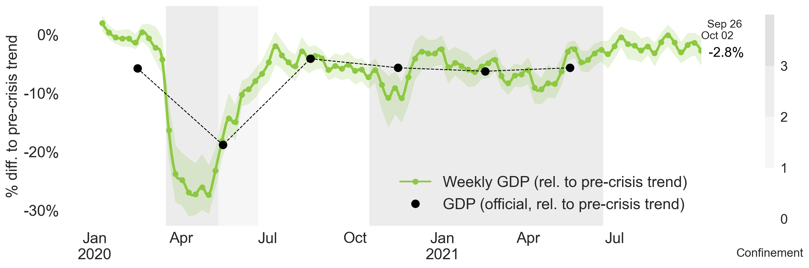

## Tracking GDP growth in real time 

The OECD Weekly Tracker of GDP growth provides a real-time high-frequency indicator of economic activity using machine learning and Google Trends data. It  has a wide country coverage of OECD and G20 countries. The Tracker is thus particularly well suited to assessing activity during the turbulent period of the current global pandemic. The Tracker provides estimates of year-on-year growth rate in weekly GDP. It applies a machine learning model to a panel of Google Trends data for 46 countries, and aggregates together information about search behaviour related to consumption, labour markets, housing, trade, industrial activity and economic uncertainty (see [blog](https://oecdecoscope.blog/2020/12/14/can-google-trends-be-used-to-track-economic-activity-in-real-time1/))

Please note these are not official OECD forecasts, which are most recently published in the [OECD Economic Outlook](https://www.oecd.org/economic-outlook/). However, the Tracker is one of several indicators that feeds into the OECD forecast process, which helps to situate the current state of the economy.

# The Weekly Tracker

<!-- ### Weekly Tracker: the United States

### Weekly Tracker: France
 -->

<iframe src=" https://gitvfd.github.io/OECD-covid-weekly-tracker/" scrolling="no" frameborder="0" allowfullscreen="" width="100%" height="550px"></iframe>

Note: The blue confidence band shows 95% confidence intervals. Red dots representing GDP growth are official outturns. Monthly GDP growth series are used when available (for the United Kingdom and Canada). The darkness of the grey background reflects confinement stringency based on the Oxford Blavatnik Index. 
Source: OECD Quarterly National Accounts; OECD Weekly Tracker; and Oxford COVID-19 Government Response Tracker (Hale et al., 2020).

Additional charts for G20 countries are [here](charts.md).

### Projections for Q4 2020 (quarter-on-quarter)

Quarter-on-quarter estimates are derived from the Weekly Tracker using a methodology described [here](qoq.md).

# Data

Download the Weekly Tracker data [here](Data\Weekly_Tracker_Excel.xlsx). 

Additional data files: 
* [Weekly Tracker (human-readable)](Data\Weekly_Tracker_Excel.xlsx)
* [Weekly Tracker (machine-readable)](Data\weekly_tracker.xlsx)
* [Quarterly estimates (year-on-year)](Data\quarterly_tracker.xlsx)
* [Quarterly estimates (quarter-on-quarter)](Data\quarter_on_quarter.xlsx)

# Methodology

Signals about multiple facets of the economy from Google Trends are extracted and aggregated using machine learning in order to infer a timely picture of the macro economy. The algorithm extracts and compiles information about consumption (e.g. from searches for “vehicles”, “households appliances”), labour markets (e.g. “unemployment benefits”), housing (e.g. “real estate agency”, “mortgage”), business services (e.g. “venture capital”, “bankruptcy”), industrial activity (e.g. “maritime transport”, “agricultural equipment”), trade (e.g., “exports”, “freight”) as well as economic sentiment (e.g. “recession”) and poverty (e.g. “food bank”).  Using many variables reduces the risk related to structural breaks in specific series, which was highlighted by the failure of the “Google Flu” experiment.

The Weekly Tracker uses a two-step model to nowcast weekly GDP growth based on Google Trends. First, a quarterly model of GDP growth is estimated based on Google Trends search intensities at a quarterly frequency. Second, the relationship between Google Trends and activity, using the same elasticities estimated from the quarterly model, is applied to the weekly Google Trends series to yield a weekly tracker. The OECD Weekly Tracker can thus be interpreted as an estimate of the year on year growth rate of “weekly GDP” (the same week compared to the previous year). 

High-frequency and big data have limitations as scientific analysis is usually not the original purpose of their collection. These caveats call for specific attention and statistical pre processing. Among the many available Google Trends variables, 215 “categories” and “topics” are judged relevant for economic analysis and selected to feature in the model. Selected variables are transformed to year on year growth rates. Finally, as the Google Search user base has increased dramatically since 2004, the relative search intensities of most search categories decrease over time. This long term trend is filtered out using a methodology described in Woloszko (2020). 

# References 

Woloszko, N. (2020), ["Tracking activity in real time with Google Trends"](https://doi.org/10.1787/6b9c7518-en), OECD Economics Department Working Papers, No. 1634, OECD Publishing, Paris, https://doi.org/10.1787/6b9c7518-en.

OECD (2020), OECD Economic Outlook, Volume 2020 [Issue 2]((https://www.oecd-ilibrary.org/sites/39a88ab1-en/1/3/2/1/index.html?itemId=/content/publication/39a88ab1-en&_csp_=fd64cf2a9a06f738f45c7aeb5a6f5024&itemIGO=oecd&itemContentType=issue)): Preliminary version, OECD Publishing, Paris, https://dx.doi.org/10.1787/39a88ab1-en.

Woloszko, N., [Can Google Trends be used to track economic activity in real-time?](https://oecdecoscope.blog/2020/12/14/can-google-trends-be-used-to-track-economic-activity-in-real-time1/), Ecoscope post, December 2020.

Woloszko, N., [Tracking GDP using Google Trends and machine learning: A new OECD model](https://voxeu.org/article/tracking-gdp-using-google-trends-and-machine-learning), VoxEU, December 2020

