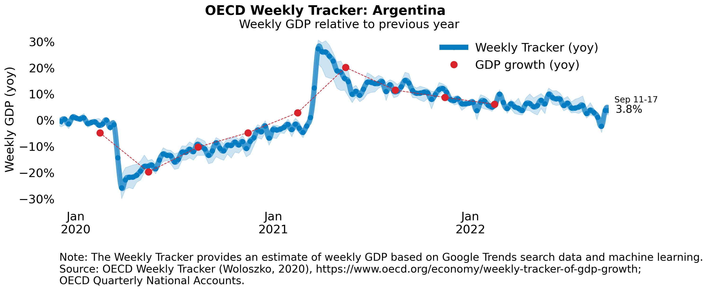
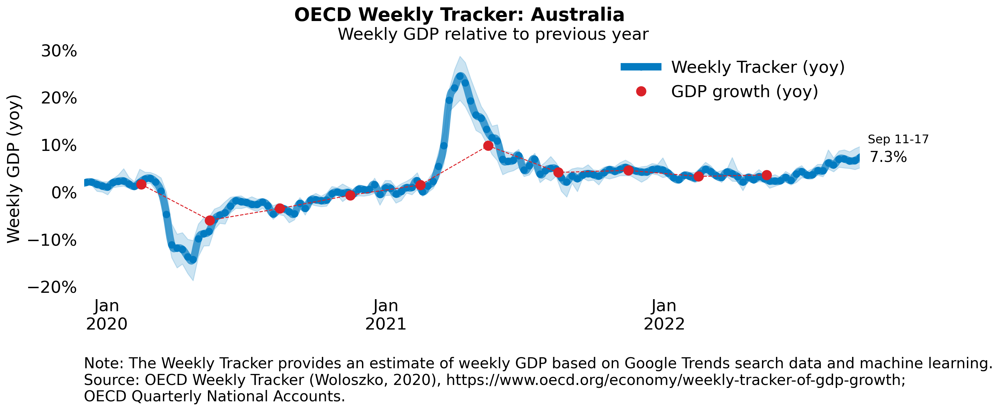
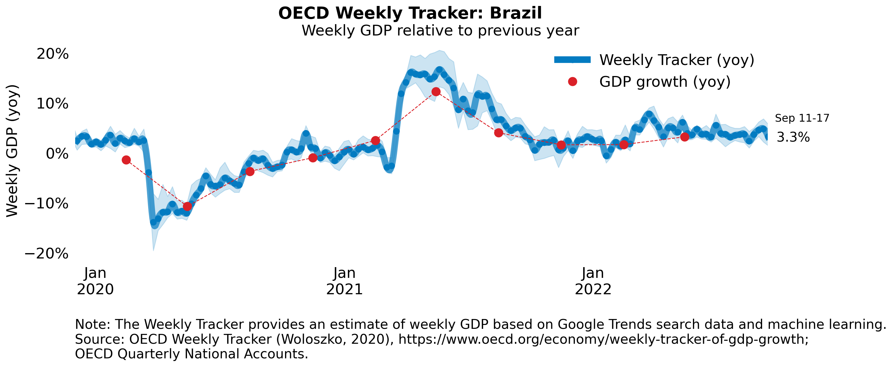
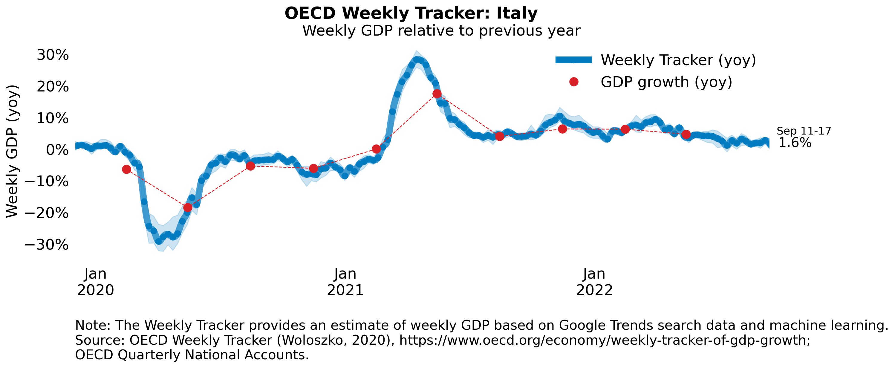
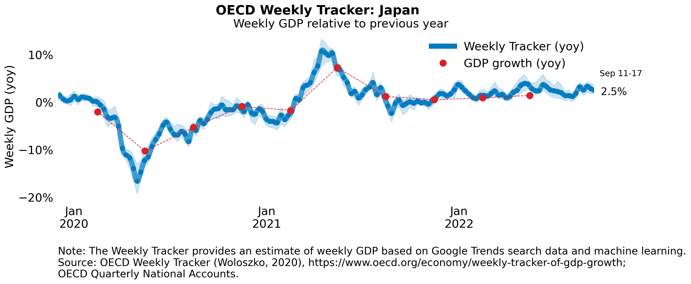

The OECD Weekly Tracker of GDP growth provides a high-frequency indicator of economic activity with a delay of less than five days, making it particularly useful when activity is changing very rapidly. It also has a wide country coverage of OECD and G20 countries. The Tracker is thus particularly well suited to assessing activity during the turbulent period of the current global pandemic. The Tracker provides estimates of year-on-year growth rate in weekly GDP. It applies a machine learning model to a panel of Google Trends data for 46 countries, and aggregates together information about search behaviour related to consumption, labour markets, housing, trade, industrial activity and economic uncertainty.

Charts for OECD and G20 countries are in the [Figures](Figures) folder. Charts for selected countries are to be found below. 

Please cite : 
Woloszko, N. (2020), "Tracking activity in real time with Google Trends", OECD Economics Department Working Papers, No. 1634, OECD Publishing, Paris, https://doi.org/10.1787/6b9c7518-en.

#webmenu{
    width:340px;
}

<select name="webmenu" id="webmenu">
    <option value="Argentina" title="Figures/Weekly_Tracker_Argentina.png"></option>
    <option value="Australia" title="Figures/Weekly_Tracker_Australia.png"></option>

</select>

$("body select").msDropDown();

1. Argentina

2. Australia

3. Brazil

4. Canada

5. France

6. Germany

7. India

8. Indonesia

9. Italy

10. Japan

11. Mexico

12. Korea

13. Russia

14. South Africa

15. Turkey

16. United Kingdom

17. United States

Note: The blue confidence band shows 95% confidence intervals. Red dots representing GDP growth are official outturns. Monthly GDP growth series are used when available (for the United Kingdom and Canada). The darkness of the grey background reflects confinement stringency based on the Oxford Blavatnik Index. 
Source: OECD Economic Outlook 108 database; OECD Weekly Tracker; UK Office for National Statistics; StatCan; and Oxford COVID-19 Government Response Tracker (Hale et al., 2020).
