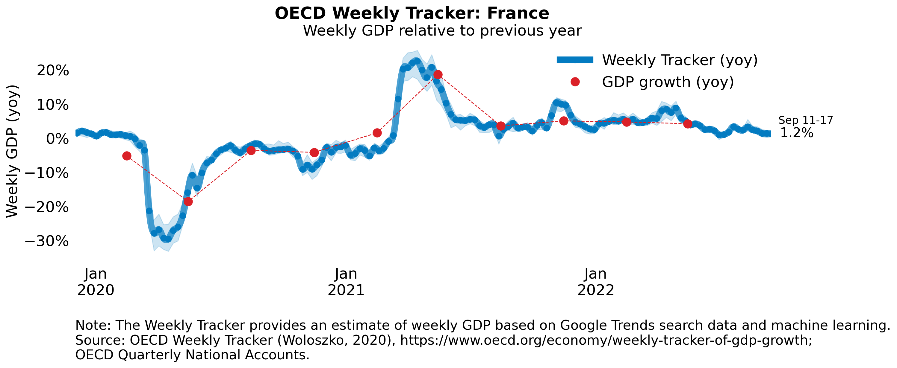
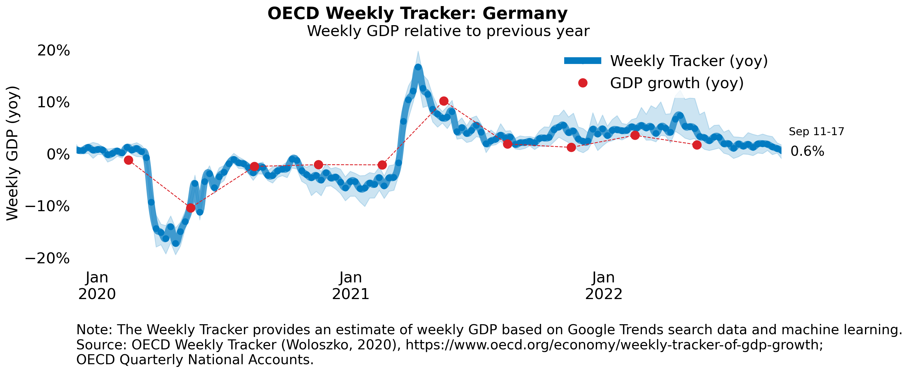
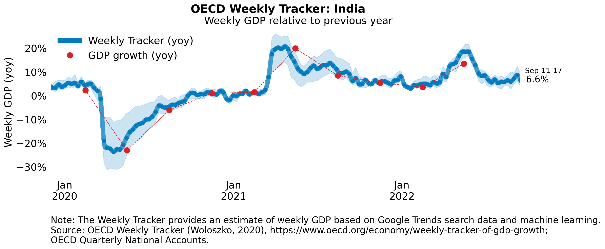
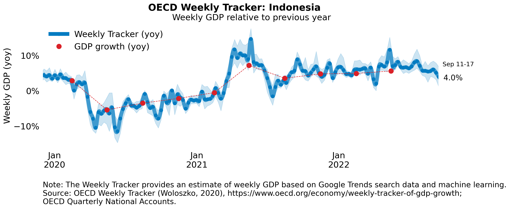
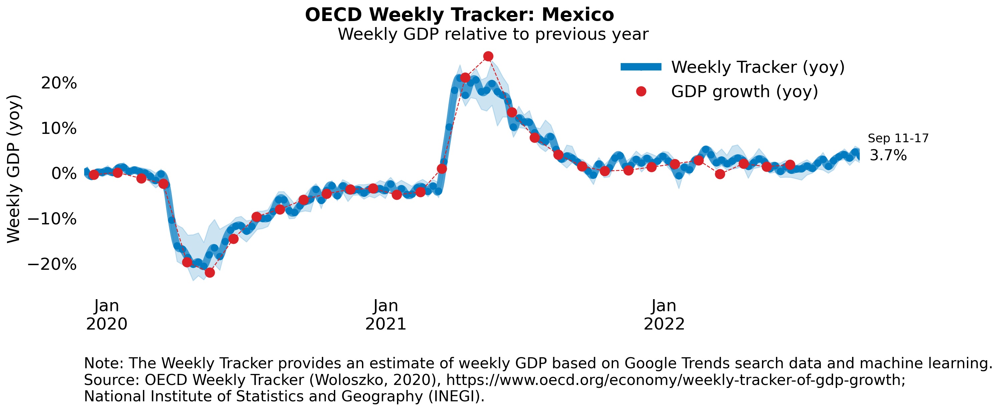
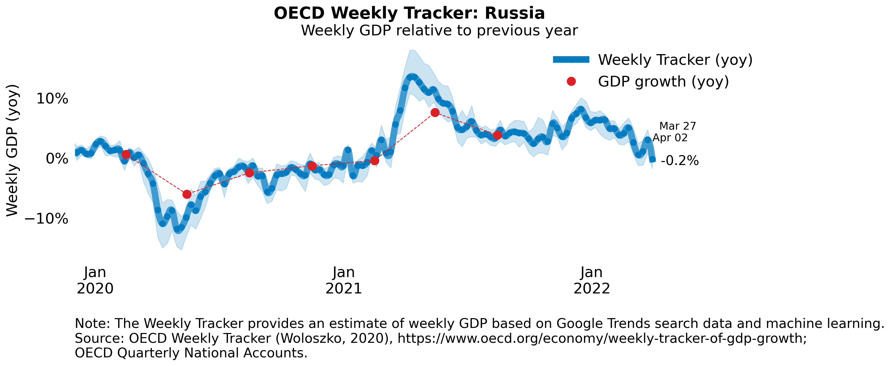

# Additional charts

1. Argentina

2. Australia

3. Brazil

4. Canada

5. France

6. Germany

7. India

8. Indonesia

9. Italy

10. Japan

11. Mexico

12. Korea

13. Russia

14. South Africa

15. Turkey

16. United Kingdom

17. United States

Note: The blue confidence band shows 95% confidence intervals. Red dots representing GDP growth are official outturns. Monthly GDP growth series are used when available (for the United Kingdom and Canada). The darkness of the grey background reflects confinement stringency based on the Oxford Blavatnik Index. 
Source: OECD Quarterly National Accounts; OECD Weekly Tracker; UK Office for National Statistics; StatCan; and Oxford COVID-19 Government Response Tracker (Hale et al., 2020).